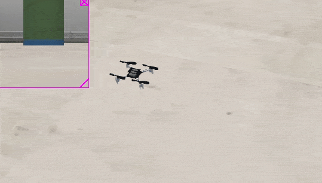
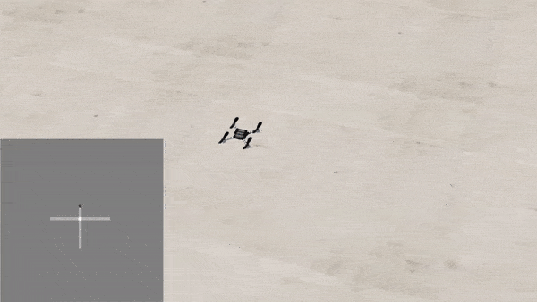

Examples
========

Here are some basic algorithms which may be helpful to the crazy-practical project.

Obstacle avoidance
------------------
This is a simple obstacle avoidance algorithm based on distance sensors.
For example, if the front distance is less than 0.2m, the drone will move left when the left distance is larger than the right distance.
The drone will move right when the right distance is larger than the left distance.
However, if the front distance is larger than 0.2m, the drone will move forward.
The code for this algorithm is::

    # Global variables
    on_ground = True
    height_desired = 0.5

    # Obstacle avoidance with range sensors
    def obstacle_avoidance(sensor_data):
        global on_ground, height_desired

        # Take off
        if on_ground and sensor_data['range_down'] < 0.49:
            control_command = [0.0, 0.0, 0.0, height_desired]
            return control_command
        else:
            on_ground = False

        # Obstacle avoidance with distance sensors
        if sensor_data['range_front'] < 0.2:
            if sensor_data['range_left'] > sensor_data['range_right']:
                control_command = [0.0, 0.2, 0.0, height_desired]
            else:
                control_command = [0.0, -0.2, 0.0, height_desired]
        else:
            control_command = [0.2, 0.0, 0.0, height_desired]

        return control_command

This example can be found in the 'example.py' file.
You can run this by uncommenting 'control_commands = example.obstacle_avoidance(sensor_data)' in 'main.py' file.
Simulation results of this algorithm are shown in the following animation.

Coverage path planning
----------------------
Given the setpoint position sets, the drone can explore an area autonomously. A basic example for this exploration control can be found in the 'example.py' file, which has the following code::

    # Coverage path planning
    setpoints = [[-0.0, 0.0], [-0.0, -2.0], [-0.5, -2.0], [-0.5, 0.0]]
    index_current_setpoint = 0
    def path_planning(sensor_data):
        global on_ground, height_desired, index_current_setpoint, setpoints

        # Take off
        if on_ground and sensor_data['range_down'] < 0.49:
            control_command = [0.0, 0.0, 0.0, height_desired]
            return control_command
        else:
            on_ground = False

        # Hover at the final setpoint
        if index_current_setpoint == len(setpoints):
            control_command = [0.0, 0.0, 0.0, height_desired]
            return control_command

        # Get the goal position and drone position
        x_goal, y_goal = setpoints[index_current_setpoint]
        x_drone, y_drone = sensor_data['x_global'], sensor_data['y_global']
        distance_drone_to_goal = np.linalg.norm([x_goal - x_drone, y_goal- y_drone])

        # When the drone reaches the goal setpoint, e.g., distance < 0.1m
        if distance_drone_to_goal < 0.1:
            # Select the next setpoint as the goal position
            index_current_setpoint += 1
            # Hover at the final setpoint
            if index_current_setpoint == len(setpoints):
                control_command = [0.0, 0.0, 0.0, height_desired]
                return control_command

        # Calculate the control command based on current goal setpoint
        x_goal, y_goal = setpoints[index_current_setpoint]
        x_drone, y_drone = sensor_data['x_global'], sensor_data['y_global']
        v_x, v_y = x_goal - x_drone, y_goal - y_drone
        control_command = [v_x, v_y, 0.0, height_desired]
        return control_command

You can run this by uncommenting 'control_commands = example.path_planning(sensor_data)' in the 'main.py' file.
Simulation results of this algorithm are shown in the following animation.

.. image:: example_coverage_path_planning.gif
  :width: 650
  :alt: example of coverage path planning

Create a world map
------------------
This is a simple occupancy grid algorithm based on distance measurements.
We loop through all four distance sensors, filling the occupancy map for each of them based on the following rules:
If an obstacle is detected, a conficdence value is subtracted, or added in case of a free cell.
If we don't have any information about that cell, it stays as it is.
At the end of the loop, we normalize the occupancy map to be between -1 and 1.
This resembles confidence about the occupancy of each cell and is more robust than just always filling in the last measurement.

The code for this algorithm is::

    global map, t
    pos_x = sensor_data['x_global']
    pos_y = sensor_data['y_global']
    yaw = sensor_data['yaw']
    
    for j in range(4): # 4 sensors
        yaw_sensor = yaw + j*np.pi/2 #yaw positive is counter clockwise
        if j == 0:
            measurement = sensor_data['range_front']
        elif j == 1:
            measurement = sensor_data['range_left']
        elif j == 2:
            measurement = sensor_data['range_back']
        elif j == 3:
            measurement = sensor_data['range_right']
        
        for i in range(int(range_max/res_pos)): # range is 2 meters
            dist = i*res_pos
            idx_x = int(np.round((pos_x - min_x + dist*np.cos(yaw_sensor))/res_pos,0))
            idx_y = int(np.round((pos_y - min_y + dist*np.sin(yaw_sensor))/res_pos,0))

            # make sure the point is within the map
            if idx_x < 0 or idx_x >= map.shape[0] or idx_y < 0 or idx_y >= map.shape[1] or dist > range_max:
                break

            # update the map
            if dist < measurement:
                map[idx_x, idx_y] += conf
            else:
                map[idx_x, idx_y] -= conf
                break
    
    map = np.clip(map, -1, 1) # certainty can never be more than 100%

    # only plot every Nth time step (comment out if not needed)
    if t % 50 == 0:
        plt.imshow(np.flip(map,1), vmin=-1, vmax=1, cmap='gray', origin='lower') # flip the map to match the coordinate system
        plt.savefig("map.png")
    t +=1

    return map

This code can be found in 'example.py' file.
You can run this example by uncommenting 'map = example.occupancy_map(sensor_data)' in the 'main.py' file.
Simulation results of this algorithm is shown in the following animation.
If the grid map is not shown automatically, you can open the 'map.png' file and see the animation.

