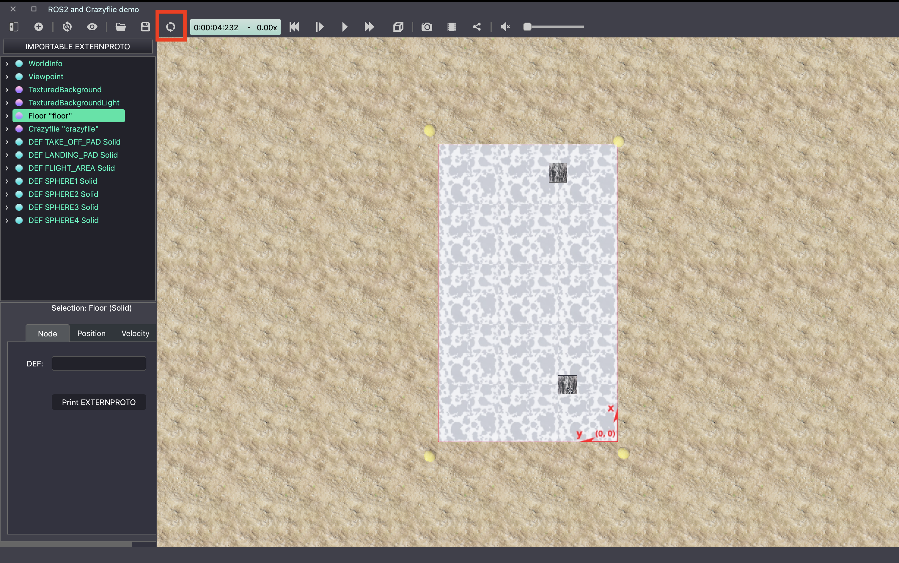

Exercise 0: Frame Transformation for Drone Control
==================================================

In this exercise, you will learn how to implement a coordinate transform for a drone using euler angles.
This will introduce you to Webots and help you to get familiar with some of the tools you will be using throughout the course.

Webots Introduction
-------------------
During this course we will use the Webots simulation environment to test code on a simulated drone.
Webots is an open-source robot simulator that provides a complete development environment to model, program, and simulate robots.
It is widely used in research and education to develop and test algorithms for robotics.

A webots simulation is defined by a world file, which specifies the environment and any robots or objects within it.
You can interact with the simulation using the Webots GUI, which allows you to control the robot, view sensor data, and visualize the environment.
You can even open code files and modify them in Webots, though you will need to reload the world for these changes to take effect.
If you prefer, you can also use your favorite text editor or IDE to edit the code files.

Task Overview
-------------
For this task you will need to convert commands for a drone from the world frame to the body frame.
This is important because the drone's orientation will change as it moves, and the control commands need to be aligned with the drone's current orientation to ensure that it moves correctly.

To start, you can run the the simulation in Webots by opening the world file (**crazyflie_world_exercise_0.wbt**) and clicking the play button.
You should see a drone in the simulation that you can control using the keys on your keyboard as follows:
- **W**: Move the drone forward
- **S**: Move the drone backward
- **A**: Move the drone left
- **D**: Move the drone right
- **Q**: Turn the drone left
- **E**: Turn the drone right

By looking at the FPV camera from the drone, you can see that this is a very easy way to fly the drone.

However, these commands are given in the body frame of the drone, while this is very useful for piloting the drone, it's not very useful if we want direct the drone relative to it's environment.
To see why not, change the control input from 'keyboard' to 'path_planning' in line 110 of the file **main.py**.

Now you can reload the world by clicking the reload button in the top left of the Webots window.

Now you will see the drone try to move to each of the yellow spheres in the world.
However, because the drone is spinning, these commands are not aligned with the drone's orientation, and the drone will not move as expected. Instead moving in a circle around the starting position.

.. image:: before_transform.gif
  :width: 650
  :alt: if tuned correclty, performance increases significantly

To fix this, you will need to implement a function to convert the control commands from the world frame to the body frame of the drone.
This will involve using the drone's current orientation, which is given as a set of Euler angles, to calculate a rotation matrix that can be used to transform the control commands.
The drone will then respond correctly to the control commands, regardless of its orientation and can even reach the yellow spheres while spinning.

.. image:: after_transform.gif
  :width: 650
  :alt: if tuned correclty, performance increases significantly

Exercise
---------

1. Start by opening the **utils.py** file and locating the **euler2rotmat(euler_angs)** function. Implement the function to calculate the rotation matrix based on the given Euler angles. Remember, Euler angles represent roll, pitch, and yaw of the drone in the world frame.

2. Next, implement the **rot_global2body(control_commands, euler_angs)** function. Use the rotation matrix you obtained from **euler2rotmat(euler_angs)** to transform the velocity commands from the world frame to the body frame. This step is crucial for ensuring that the drone's movements are correctly aligned with its current orientation.

3. Test your implementation in the Webots simulation environment (**drone_world_exercise_2**). You should observe that the drone responds accurately to control commands and reaches each of the yellow spheres despite its spinning motion.

Bonus challenge
---------------
To further test your skills, see if you can complete the same task using quaternions instead of Euler angles. 

====================================================================================
Any questions about the exercise, please contact Benjamin Jarvis (benjamin.jarvis@epfl.ch).
