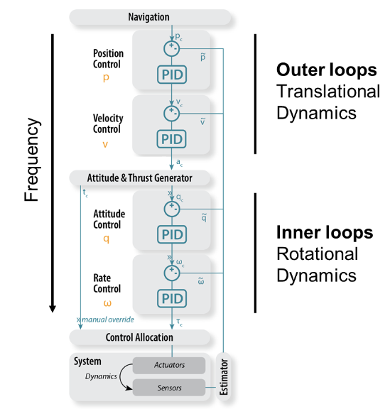

Exercise 1: Cascaded PID control
==================================

In this exercise, you will learn how to tune a cascaded PID controller for the CrazyFlie (**pid_control.py**). 
It uses a simplistic version of the controller seen in the lecture:
On the highest level, it receives a linear velocity command, a desired yaw rate as well as an attitude reference.
The first two then get converted into desired roll and pitch commands.
This leads to the final layer, where roll, pitch, yaw_rate and attitude commands are passed through a mixer and lead to motor inputs.

Task overview
-------------

For this task you will learn how to systematically tune each layer of the cascaded controller and thus improve the overall control performance.
To start, you can run the simulation on webots (**crazyflie_world_excercise_1**) and you should see a badly tuned controller flying through a parcour, marked by four spheres.
Note that webots tells you how long it takes the drone to complete the task: With the initial gains it takes roughly 24.5s. 

.. image:: square_before.gif
  :width: 650
  :alt: initial gains lead to bad performance

If tuned successfully, you will end up with a much better performance, completing the parcour within roughly 20s.

.. image:: square_after.gif
  :width: 650
  :alt: if tuned correclty, performance increases significantly

Exercise
---------
The key to a successful tuning is to start from a stable state. First you need to make sure that your drone can keep an altitude.
Start by opening **pid_control.py** and change the variable **self.tuning_level = "altitude"**.
This will now send step inputs as an altitude reference to your drone, which it will try to track. 
After two iterations, a plot displays the most important metrics for tuning:
- Rise time: How long it takes the system to reach the reference. This should be as short as possible.
- Oversthoot: How much your system exeeds the reference after reaching it. This should stay within a certain range (we suggest less than 10%).
- Steady state error: Your system might not converge fully to your reference. This should stay within a certain range (we suggest less than 5%).

.. image:: altitude_before.png
  :width: 650
  :alt: altitude tracking before tuning

As a general rule of thumb, we propose the following strategy: 
- Start with a small P and I,D = 0.
- If an offset term exists (e.g. to provide constant thrust to fight gravity), increase it until you get symmetric behaviour
- Increase P until you see an overshoot.
- Increase D until the overshoot vanishes.
- Repeat last two steps until increasing D does no longer stabilize your system.
- Reduce P to last stable value and adapt D accordingly.
- If nescessary, increase I to counteract steady state error.

This should lead you to similar performance:

.. image:: altitude_after.png
  :width: 650
  :alt: altitude tracking after tuning

If your drone successful tracks altitude, you should tune the cascaded controller from the bottom up:
- **self.tuning_level = "attitude"**
- **self.tuning_level = "yawrate"**
- **self.tuning_level = "velocity"**

Once you are happy with your gains, disable tuning (**self.tuning_level = "off"**) and tell an assistant your gains and the time it takes your CrazyFlie to finish the parcour.
We will keep a live score board during the exercise.

Bonus challenge
---------------
The references that are sent through the cascaded control architecture are capped to make your drone more stable (e.g. when you request 1 [rad] in roll, it still send a maximum reference of 0.5 [rad]).
For faster flight, you can increase the maximum reference by adapting **max_velocity**, **max_attitude** and **max_yawrate**.
If you really want to push your drone to the limit, you can even increase the cap on the motor commands by adapting **max_command_attitude** and **max_command_attitude**.

Our best time is 13.9s. Let the fastest drone win!

====================================================================================
Any questions about the exercise, please contact Simon Jeger (simon.jeger@epfl.ch).