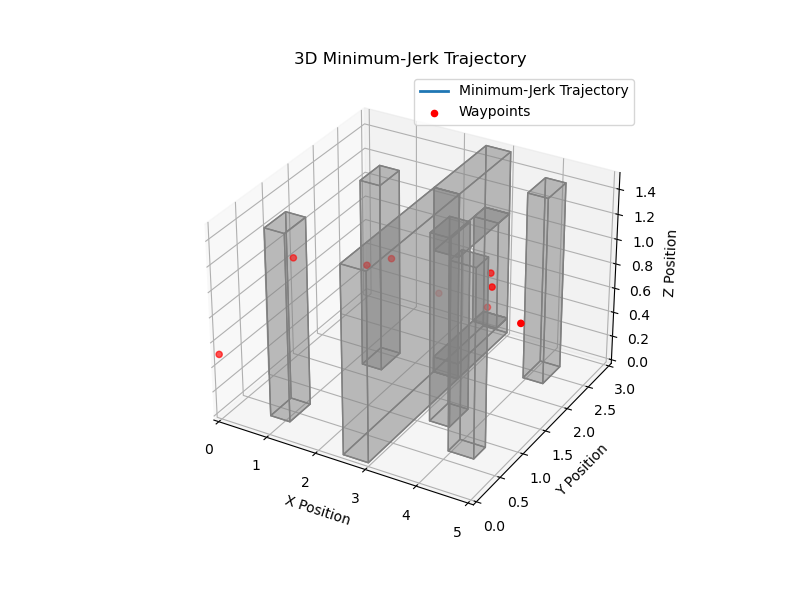

Exercise 3: Motion Planning
==================================

In this exercise, you will explore motion planning between waypoints using polynomial trajectories. 
Given pre-planned path waypoints, your goal is to calculate minimum-jerk polynomial trajectories and make your drone navigate through a field of obstacles safely, smoothely and as fast as possible!

Task description
-----------------

First, in Webots, open **crazyflie_world-motion_planning.wbt** and take a look at the obstacle map, it should look as shown in the Figure below.

The map shows a take-off location, some obstacles and even a small gap through which you must plan a smooth path in order to reach your final goal.
The final goal is indicated by a pink square.

With **exp_num = 3** in **main.py**, launch the simulation. You will see a waypoint map in a 3D environment, as shown below:

The red waypoints are planned using a 3D A* path planner, giving you the shortest path to reach the final goal while avoiding all obstacles.
However, A* assumes separate straight-line connections between the waypoints, such that your drone movements will not be smooth while following this path.

To improve smoothness and plan a feasible trajectory for the drone to follow, you will calculate polynomial trajectories that are continouous in velocity, acceleration, snap and jerk about every waypoint.

Exercise
---------

Part 1 - Implementation
-------------------------------------------
You will implement your code in the file **ex3_motion_planner.py**.

It is suggested to take the lecture slides as a reference for the motion planner implementation.

**Hint**: For matrix multiplications with two-dimensional numpy arrays, use numpy.matmul or the python operator "@" 

1. Go to the function *compute_poly_matrix*. This function defines a matrix *A_m(t)* such that :math:'x_m(t) = A_m(t)c_m' at a given time *t*, where x_m(t) = [x, \dot{x}, \ddot{x}, \dddot{x}, \ddddot{x}]^T  and the unknown polynomial coeffcients of a path segment are given as :math:'c_m = [c_0,m, c_1,m, c_2,m,  c_3,m, c_4,m, c_5,m]^T'. This will later be used to define the constraint system of equations at every path segment.

  a) By hand, calculate x_m(t) = [x, \dot{x}, \ddot{x}, \dddot{x}, \ddddot{x}]^T based on the given mimimum-jerk trajectory solution x(t) from the lecture.

  b) From your solution, implement *A_m* as a 2D 5 x 6 np.array in function of *t* such that it fulfills the system :math:'x_m(t) = A_m(t)c_m'.

2. Go to the function *compute_poly_coefficients*. This function takes in the AStar waypoints *path_waypoint* and then creates and solves the entire system of constraint equations **A * c = b** to yield the polynomial coefficients for each of the *m* path segments between the start and goal position.
   Here, the rows of the matrix **A** and vector **b** are to be filled to represent all initial and final position, velocity and acceleration constraints as well as the conitnuity constraints for position, velocity, acceleration, snap and jerk between two consecutive path segments.
   To help your implementation, you are given the vector *seg_times*, which contains the relative duration of each path segment as derived from *self.times*. The variable *m* contains the total number of path segments.
   For each dimension in x,y and z direction, the matrix **A** and vector **b** are initialized and the vector of *m* waypoint positions is given. An example of how to use the *compute_poly_matrix* function to obtain entries of A at the start of a path segment (t=0) is provided.

  a) For every dimension x, y, and z, iterate through the path segments to calculate all 6*(m-1) rows of the matrix **A** and the vector **b**. The entries of A can be determined by calling the function *compute_poly_matrix* with t=0 for constraints at the start of a path segment or at the entry *seg_times[i]* for constraints at the end of a segment. At the start and end of the entire path, the velocities and accelerations must be zero.

  b) Solve the system **A * c = b** for every x,y and z dimension. The coefficent vector **c** for each dimension is then added to a 2D np.array *poly_coeffs* of dimensions (6(m-1) x 3).

3. When all functions are implemented, run the simulation in Webots. You should see a trajectory plotted in blue at the start of the simulation (as per the figure below).

   To validate your implementation, check the following: Does the trajectory pass through all of the red waypoints? Does the trajectory intersect any of the grey obstacles? Does the trajectory appear continouous about the waypoints?

   When you are happy with your trajectory, close the plot and watch the simulation run. The drone should smoothly follow the trajectory and avoid the obstacles.

   .. image:: Figures/Figure_traj.png
  :width: 750
  :alt: Polynomial trajetory and 3D waypoints in obstacle map
  :align: center

  .. image:: Figures/crazyflie_world_motion_planning_traj_run.gif
  :width: 750
  :alt: Polynomial trajetory and 3D waypoints in obstacle map Simulation run
  :align: center

Part 2 - Trajectory finetuning
-------------------------------------------

1. It is possible that you see your drone moving in a rather jagged fashion between certain waypoints or, in the worst case, even collides with obstacles. This means that the polynomial trajectory should be discretized at smaller intervals to be used as a reference by the drone controller.

  a) In the function *init_params*, the variable *self.disc_steps* can be used to tune this. Increase this value in small increments until you see smoother motion.

2. When your drone moves sufficiently smoothly and you obtain no collisions, study the vector *self.times*. Every entry in this vector corresponds to the predefined absolute time at which the drone should pass a corresponding waypoint. 
  **Note:** At the starting point, *self.times[0] = 0*. At the goal position the last entry self.times[m-1] corresponds to a final time *t_f* taken to fly all *m* trajectory segments.

  a) You can now reduce the total time taken for your drone to reach the goal point by changing the variable *t_f*. At the start of every run, you will further see the maximum velocity and acceleration achieved during the run. Upon trajectory completion, the total time taken is displayed and should approximately coincide with the value of *t_f*. 
     If you obtain an assertion error that these values exceed the specified limits, increase *self.vel_lim* and *self.acc_lim* accordingly. How low can you set your time without crashing the drone?
  
  b) (BONUS) The vector *self.times* is implemented such that every path segment should be completed within the same amount of time. However, depending on the length of each path segment, this may mean that in certain path segments your drone is constrained to accelerate faster if the path segment is long or slower if it is short. 
     Can you modify the vector *self.times* to yield a better distribution of times, such that the indicated average velocity and peak acceleration are lower? Can you achieve an even faster time to complete the run without crashing with your implementation?

Part 3 - Collision replanning (BONUS)
--------------------------------------------

When flying aggresively, your drone may have some close calls with obstacles and the poor PhD student that is stuck in the drone dome :(
Can you replan the trajectory to add path waypoints that ensure a larger margin to obstacles? You can implement this in the function *collision_replanning*, set the *replan_flag = True* and redefine the variable *self.path* to add a second re-planning step.

====================================================================================
Any questions about the exercise, please contact Julius Wanner (julius.wanner@epfl.ch).