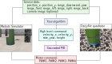

Project description
===================

In this project, you will learn how to program a Crazyflie to find and precisely land on a platform with the help of minimal sensory information.
Additionally, you will use sensor readings to avoid the obstacles present in the environment.
In the first three weeks, all students have to individually perform the following task in Webots simulator.
In the last three weeks, all students will compete as groups to achieve the same task on the real drone.

Task overview
-------------

.. image:: objective_figure.png
  :width: 650
  :alt: objective figure

The arena for the competition is shown in the figure above. The task you are required to complete in this arena is composed of multiple phases:

- The drone takes off from a take-off pad placed within the starting region.
- Thanks to the optic-flow sensor and a downward-range finder the drone can track its movements and find the landing pad in the landing zone.
- Once the landing pad is found, the drone has to precisely land on it.
- Upon successful landing, the drone takes off, flies back and lands on the take-off pad.
- In the whole arena, there can be a few obstacles of previously unknown dimensions which can be detected with the multiranger deck. Your developed algorithm should allow the drone to avoid any collisions.

Please note that the center position of the take-off pad is randomly assigned but known beforehand.
In the figure above, the origin is indicated, along with the axes of the X and Y directions.

Here is a real-world test example of this project from last year:

.. image:: demo_2022.gif
  :width: 650
  :alt: demo video from last year

System scheme
-------------
The data flow diagram for both the simulation and the real quadrotor is shown below.
Though they have the same types of sensory inputs and control outputs, your algorithm in simulation should be tuned in the real world in order to control the real drone.

Performance metrics
-------------------

- **Grade 4.0**: Take off and avoid obstacles
- **Grade 4.5**: Find the landing pad and land on it
- **Grade 5.0**: Take off again and explore again
- **Grade 5.5**: Find and land on the take-off pad
- **Grade 5.5 + f(t)**: For students who complete the full task, the grading will be based on the time taken to complete the task. The top 25% of students will receive a grade of f(t)=0.5, the next 50% will receive a grade of f(t)=0.25, and the bottom 25% will receive a grade of f(t)=0.
- **Final_grade = 0.7 * sim_grade + 0.3 * hardware_grade**: The final grade is a weighted average of the simulation and hardware grades.

Project schedule
----------------
The following table provides the arrangement of the crazy-practical project.

==========================  ========================================================
**Week**                    **Notes**
| Week 8, April 18          | Project introduction, Simulation installation, Q&A
| Week 9, April 25          | Simulation development, Q&A
| Week 10, May 2            | Simulation development, Q&A
                            | Simulation due 23:59 May 8, submit code in Moodle
                            | Select the hardware group in Moodle before 15:00 May 9
| Week 11, May 9            | Hardware introduction, pick up your drone by group
                            | Hardware development, Q&A
| Week 12, May 16           | Hardware development, Q&A
| Week 13, May 23           | Hardware development, Q&A
| Week 14, May 30           | Hardware demonstrations, hand in the drones
==========================  ========================================================

Any questions about the task, submission, schedule and grading, please contact Shushuai Li (shushuai.li@epfl.ch).