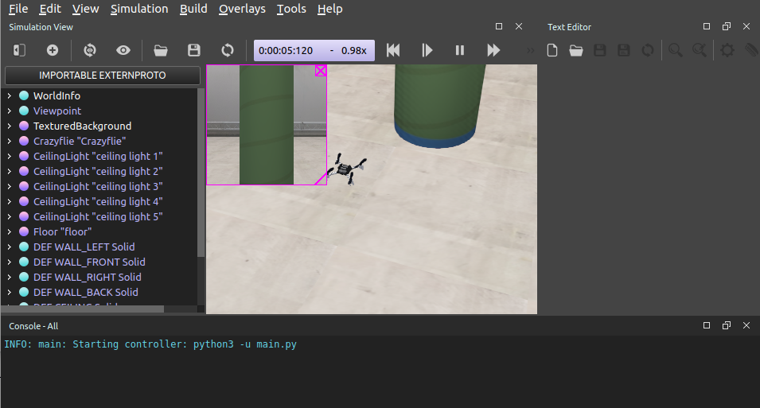

Simulation quickstart
=====================

Webots installation
-------------------
Download Webots R2023a according to the operation system of your laptop.

- For Ubuntu 20.04 & 22.04, you will download the `webots_2023a_amd64.deb <https://github.com/cyberbotics/webots/releases/download/R2023a/webots_2023a_amd64.deb>`_. To install the deb file, run the following command in your terminal:

.. code-block:: console

	$ sudo dpkg -i install webots_2023a_amd64.deb

- For Windows 10, you will download and install the `webots-R2023a_setup.exe <https://github.com/cyberbotics/webots/releases/download/R2023a/webots-R2023a_setup.exe>`_.
- For macOS, you will download and install the `webots-R2023a.dmg <https://github.com/cyberbotics/webots/releases/download/R2023a/webots-R2023a.dmg>`_. For error like 'unidentified developer', try 'right-click' the application and choose 'open'. For error of 'Python was not found' in Webots, put the correct Python path in 'Webots->preferences->python command'. To find the python path, open terminal, type 'python3', type 'import sys', and type 'print(sys.executable)'.

For library missing error, you can type 'pip3 install numpy' or 'pip3 install matplotlib' in the terminal. For more information about Webots, refere to `Webots website <https://cyberbotics.com/>`_.

Run simulation
--------------
Once you install the Webots software, download the project repository with command:

.. code-block:: console

	$ git clone https://github.com/dronecourse-epfl/crazy-practical2023.git

Open Webots software, click File -> Open World, and select the 'crazy-practical2023/worlds/crazyflie_world_epfl_lis.wbt' file to load the simulated world.

Then, you should see the Webots software as follows without any errors in the console pane.

By default, you can control the drone in Webots with your keyboard, i.e., 'W': move forward, 'S': move back, 'A': move left, 'D': move right, 'Q': turn left, and 'E': turn right.

You can also try the buttons that can start, pause, stop, restart, and accelerate the simulation.

Remember to select 'Close without Saving' when you close Webots software, such that you will not change the simulated world environments.

Controller switch
-----------------
The simulation starts with the `main.py <https://github.com/dronecourse-epfl/crazy-practical2023/blob/main/controllers/main/main.py>`_ file.

To run your algorithm instead of the keyboard control, you can comment 'control_commands = drone.action_from_keyboard()' and uncomment 'control_commands = my_controller.step_control(sensor_data)' in the 'main.py' file.

All you need to do is to create your algorithms in the 'my_control.py' file which you should submit for getting simulation grades. Details on how to submit can be found in the section “Leaderboard”.

To test your method with random positions of both the pads and obstacles, set 'enable_random_environment = True' in the main.py file.

Cascaded control
----------------
Do you remember the cascaded control from the lecture?
Yes, it is implemented in simulation as well for low-level control of velocity and attitude.
You don't need to change this PID control.
Let's have a look at the code::

  # File of crazy-practical2023/controllers/main/pid_control.py
  def pid(self, dt, action, actual_roll, actual_pitch, actual_yaw_rate,
          actual_alt, actual_vx, actual_vy):

    gains = {"kp_att_y": 1, "kd_att_y": 0.5, "kp_att_rp": 0.5, "kd_att_rp": 0.1,
            "kp_vel_xy": 2, "kd_vel_xy": 0.5, "kp_z": 10, "ki_z": 5, "kd_z": 5}

    # Actions
    desired_vx, desired_vy, desired_yaw_rate, desired_alt = action[0], action[1], action[2], action[3]

    # Velocity PID control
    vxError = desired_vx - actual_vx
    vxDeriv = (vxError - self.pastVxError) / dt
    vyError = desired_vy - actual_vy
    vyDeriv = (vyError - self.pastVyError) / dt
    desired_pitch = gains["kp_vel_xy"] * np.clip(vxError, -1, 1) + gains["kd_vel_xy"] * vxDeriv
    desired_roll = -gains["kp_vel_xy"] * np.clip(vyError, -1, 1) - gains["kd_vel_xy"] * vyDeriv
    self.pastVxError = vxError
    self.pastVyError = vyError

    # Altitude PID control
    altError = desired_alt - actual_alt
    altDeriv = (altError - self.pastAltError) / dt
    self.altIntegrator += altError * dt
    altCommand = gains["kp_z"] * altError + gains["kd_z"] * altDeriv + gains["ki_z"] * np.clip(self.altIntegrator, -2, 2) + 48
    self.pastAltError = altError

    # Attitude PID control
    pitchError = desired_pitch - actual_pitch
    pitchDeriv = (pitchError - self.pastPitchError) / dt
    rollError = desired_roll - actual_roll
    rollDeriv = (rollError - self.pastRollError) / dt
    yawRateError = desired_yaw_rate - actual_yaw_rate
    rollCommand = gains["kp_att_rp"] * np.clip(rollError, -1, 1) + gains["kd_att_rp"] * rollDeriv
    pitchCommand = -gains["kp_att_rp"] * np.clip(pitchError, -1, 1) - gains["kd_att_rp"] * pitchDeriv
    yawCommand = gains["kp_att_y"] * np.clip(yawRateError, -1, 1)
    self.pastPitchError = pitchError
    self.pastRollError = rollError

    # Motor mixing
    m1 =  altCommand - rollCommand + pitchCommand + yawCommand
    m2 =  altCommand - rollCommand - pitchCommand - yawCommand
    m3 =  altCommand + rollCommand - pitchCommand + yawCommand
    m4 =  altCommand + rollCommand + pitchCommand - yawCommand

For example, given the desired velocity commands, the outer-loop PID calculates the desired attitude which is taken as inputs in the inner-loop PID to calculate the desired torques for motor speed control.